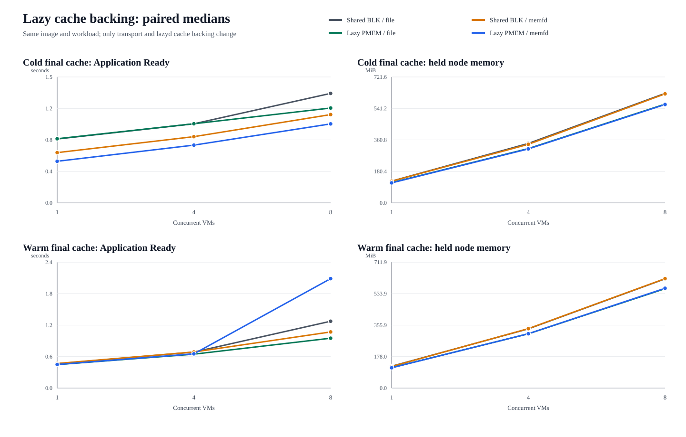
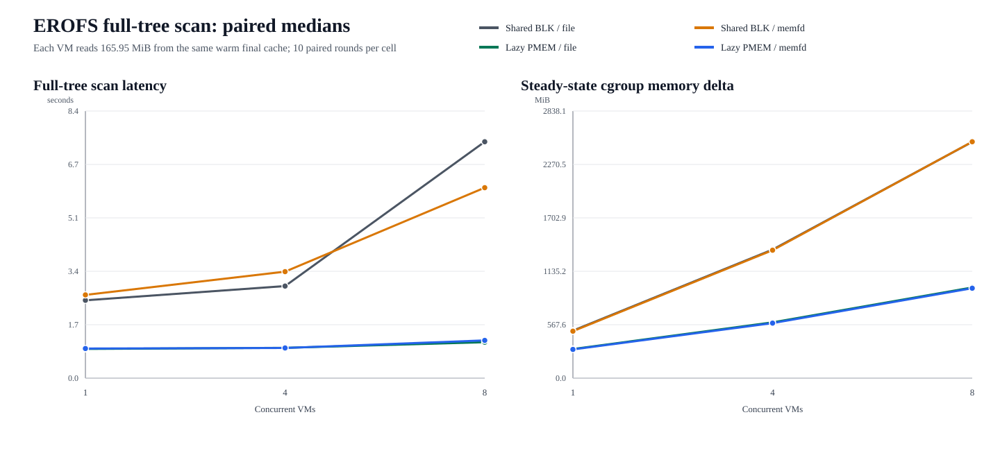
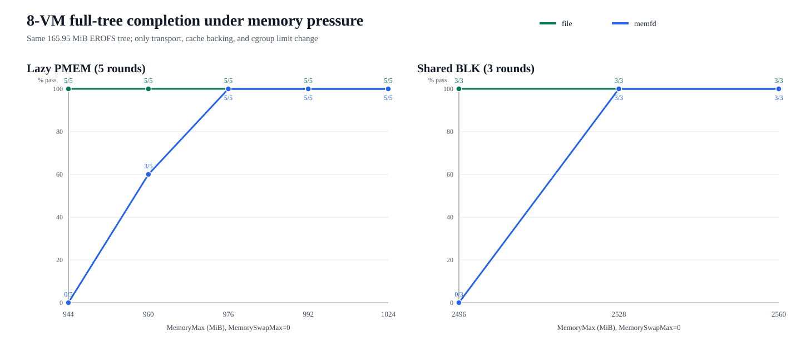

# lazyd file/memfd backing 设计与性能结论

## 结论

lazyd 保留两种最终明文 EROFS cache backing：

- `file` 继续作为生产默认：可持久化恢复，clean page 可被内核回收；
- `memfd` 作为实验性 volatile 选项：不创建明文 cache 路径，减少冷路径落盘
  写入，但需要额外内存余量，并要求禁用或加密 swap。

backing 是 lazyd 的节点/trust-domain 级策略，不是 sandbox 级参数。BLK、PMEM、
sandboxer 和 Cloud Hypervisor 继续使用同一套 `instance_id + FETCH +
SCM_RIGHTS read-only FD` 契约，不感知 cache 最终由 file 还是 memfd 承载。

## 实现

新增 `CacheBacking` 抽象：

```text
Remote range
    |
    v
lazyd canonical extent + materialization window
    |
    +-- file  -> sparse EROFS file + persistent readiness map
    |
    +-- memfd -> sparse shmem object + volatile readiness map
                       |
                       +-- read-only FD -> shared-cache BLK
                       |
                       +-- read-only FD -> Lazy PMEM MAP_FIXED
```

memfd 使用 `MFD_CLOEXEC | MFD_ALLOW_SEALING`，固定对象大小，并设置
`F_SEAL_GROW | F_SEAL_SHRINK | F_SEAL_SEAL`。lazyd 保留内部可写 file
description，消费者只能收到从 `/proc/self/fd` 重新打开的只读 description。

兼容性约束：

- 默认仍为 `--cache-backing=file`；
- `memfd` 当前只支持 Kuasar canonical source + external trigger；
- OCI/fanotify 原有 file 行为不变；
- memfd 不创建 sparse cache 路径或持久 bitmap，lazyd 重启后重新物化；
- wire schema、range 对齐、content identity 和 CH 参数不变。

## 测试矩阵

正式样本共 608 个，不含预检：

| 测试 | 样本 |
|---|---:|
| Current BLK/shared-cache BLK/Lazy PMEM，cold/warm，1/4/8 VM，10 轮 | 180 |
| Nginx cold/warm，1/4/8 VM，BLK/PMEM，file/memfd，10 轮 | 240 |
| openEuler 165.95 MiB 全树，1/4/8 VM，四组合，10 轮 | 120 |
| 8 VM PMEM，944–1024 MiB，禁用 swap，5 轮 | 50 |
| 8 VM BLK，2496–2560 MiB，禁用 swap，3 轮 | 18 |

所有功能样本的 workload 结果一致。PMEM 样本同时校验
fault/FETCH/mmap/wake 闭合、单 cache identity、无 private dirty；cache-warm
全树正式测量期间 accelerator 和 lazyd 均没有再次物化数据。

## 三路径产品基线

三路径矩阵使用同一个 Nginx EROFS 镜像和首次请求 workload：

1. 当前 `manifest:// + vhost-user-blk`；
2. 使用 lazyd 最终明文 cache 的 shared-cache BLK；
3. 使用同一 lazyd cache 的 Lazy PMEM。

8 VM 中位数：

| cache | 指标 | Current BLK | BLK + shared cache | Lazy PMEM |
|---|---|---:|---:|---:|
| cold | Application Ready | 2.801 s | 1.348 s | 1.112 s |
| cold | held cgroup memory | 835.6 MiB | 628.1 MiB | 566.6 MiB |
| warm | Application Ready | 2.948 s | 1.038 s | 0.977 s |
| warm | held cgroup memory | 836.6 MiB | 613.1 MiB | 565.7 MiB |

按 round 配对后：

- shared-cache BLK 相对 Current BLK，cold/warm Application Ready 分别改善
  56.3%/62.2%，held memory 分别改善 24.8%/26.6%；
- Lazy PMEM 相对 Current BLK，cold/warm Application Ready 分别改善
  60.6%/65.2%，held memory 分别改善 32.0%/32.5%；
- Lazy PMEM 相对 shared-cache BLK，cold Application Ready 改善 18.2%
  （95% bootstrap CI 0.8%..25.4%），warm 改善 8.0%
  （CI -10.5%..12.0%，不显著）；held memory 在 cold/warm 下分别改善
  9.9%/7.9%，10/10 轮均更低。

因此，小工作集的大部分启动和 CPU 收益来自公共明文 cache；PMEM 的稳定独立
增量是进一步减少逐 VM Guest page cache，cold 启动也有额外收益。该结论与后面的
高重合全树结果一致，但不能外推到所有单 VM workload。


## 小工作集

Nginx cold cache 的 8 VM 中位数：

| Transport | file App Ready | memfd App Ready | file host writes | memfd host writes |
|---|---:|---:|---:|---:|
| Shared BLK | 1.340 s | 1.081 s | 12.6 MiB | 1.5 MiB |
| Lazy PMEM | 1.161 s | 0.967 s | 11.8 MiB | 1.5 MiB |

memfd 明显减少冷路径持久化写入。warm cache 时 file/memfd 没有稳定时延差异；
8 VM PMEM/memfd 出现过调度抖动，因此不使用这组小工作集数据证明启动时延优势。



## 高重合工作集

每个 VM 遍历同一 openEuler EROFS 可见树并读取 165.95 MiB。8 VM 中位数：

| Transport | Backing | 全树扫描 | whole-cgroup memory | operation CPU |
|---|---|---:|---:|---:|
| Shared BLK | file | 7.463 s | 2510.4 MiB | 70.02 s |
| Shared BLK | memfd | 6.012 s | 2511.6 MiB | 64.50 s |
| Lazy PMEM | file | 1.134 s | 963.6 MiB | 12.41 s |
| Lazy PMEM | memfd | 1.191 s | 955.7 MiB | 12.77 s |

在相同 backing 下，PMEM 相对 shared-cache BLK 的成对中位改善：

| Backing | 全树扫描 | measured group memory | whole-cgroup memory | operation CPU | 胜率 |
|---|---:|---:|---:|---:|---:|
| file | 84.0% | 67.5% | 61.6% | 81.9% | 10/10 |
| memfd | 76.7% | 67.6% | 61.9% | 77.9% | 10/10 |

8 VM PMEM 映射的 RSS/PSS P50 为 `1392.2/174.0 MiB`，比例为 8.0，且
file/memfd 都只有一个 cache identity。这直接说明八个 VMM 映射复用了同一组
最终 EROFS Host 页；BLK 即使共享取数 cache，仍会在各 Guest RAM 中建立独立
page cache。



## 内存压力

每个样本使用 8 VM、同一 165.95 MiB 全树、`MemorySwapMax=0`。

PMEM 5 轮：

| MemoryMax | file | memfd |
|---:|---:|---:|
| 944 MiB | 5/5 | 0/5 |
| 960 MiB | 5/5 | 3/5 |
| 976 MiB | 5/5 | 5/5 |
| 992 MiB | 5/5 | 5/5 |
| 1024 MiB | 5/5 | 5/5 |

BLK 3 轮：

| MemoryMax | file | memfd |
|---:|---:|---:|
| 2496 MiB | 3/3 | 0/3 |
| 2528 MiB | 3/3 | 3/3 |
| 2560 MiB | 3/3 | 3/3 |

file 在硬限制边缘有约 16–32 MiB 的额外回收余量。memfd 并非正常余量下更慢或
不可用，但其 shmem 不能像 clean file page 一样丢弃并从本地文件重新 fault-in。



## 设计判断

1. PMEM 的独特价值不是“也能按需取数”，而是同 trust domain、同镜像 VM
   复用最终不可变 EROFS Host 页；收益随 VM 数、工作集大小和重合度提高。
2. shared cache 是 BLK/PMEM 公共能力；PMEM 不重新实现 Manifest、chunk、
   解密或 canonical extent。
3. 三路径数据表明，小工作集的大部分启动收益属于 shared cache；PMEM 应以
   多 VM 最终页共享和节点密度作为首要理由。
4. memfd 解决的是明文路径和冷路径写入问题，不应被包装成 PMEM 性能来源。
5. file 与 memfd 都保留是合理的，但 file 必须继续作为默认。
6. memfd 进入生产前仍缺 consumer lease：只要 sandbox 未来还可能触发缺页，
   lazyd 就不能删除该 volatile instance。

## 验证

产品分支验证：

```text
cargo fmt --check
cargo test --quiet
cargo clippy --all-targets -- -D warnings
```

结果：97 个测试全部通过，clippy 零 warning。

原始数据和统计：

- `results/cache-backing`
- `results/three-path`
- `results/full-tree`
- `results/pmem-pressure`
- `results/blk-pressure`
