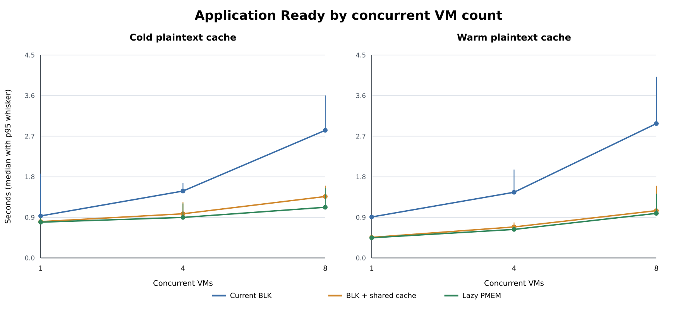
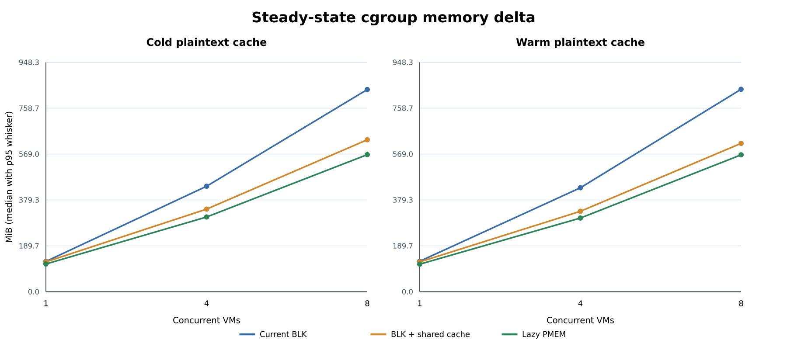
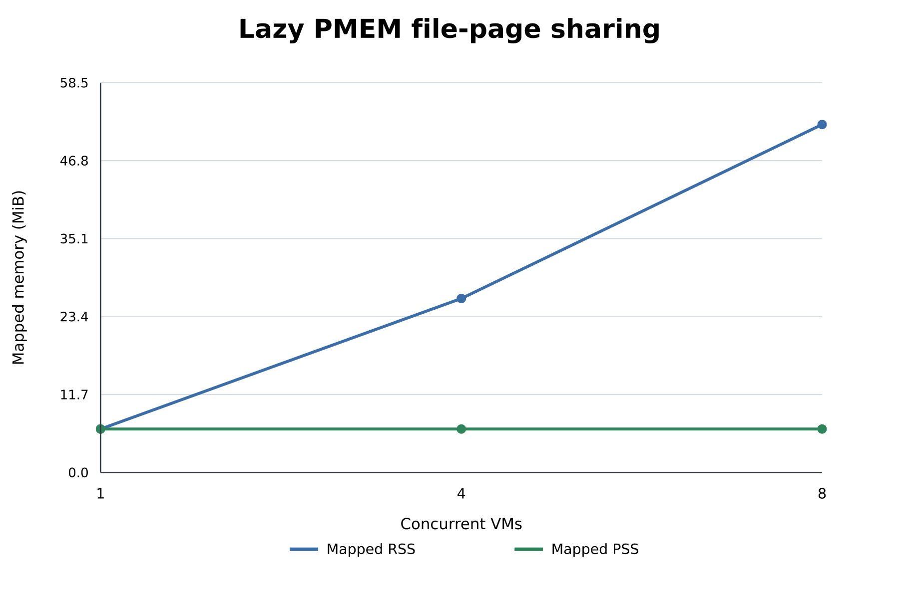
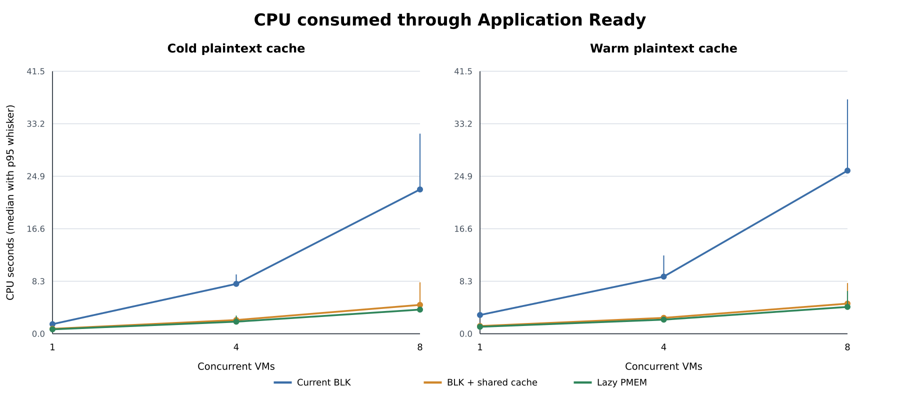

# Kuasar Lazy PMEM three-path performance

## 方法

- 对比路径为当前 `manifest:// + vhost-user-blk`、复用同一 lazyd plaintext cache 的 `vhost-user-blk`，以及复用该 cache 的 Lazy PMEM。前两者用于拆分公共 cache 收益，后两者用于拆分 PMEM/DAX transport 增量。
- `plaintext-cold` cell 不启动 warmup VM，shared-cache BLK 与 Lazy PMEM 均从新的空 lazyd cache 开始；测试不写全局 `drop_caches`，因此不宣称宿主机块页绝对冷。
- `plaintext-warm` cell 先用相同模式运行一个 warmup VM，随后在同一组 backend 服务中采集正式 VM；计数器基线在 warmup 后重置。当前 BLK 没有 plaintext cache，只保留其现有 store/host cache 行为。
- 每个样本运行在独立 systemd service cgroup，采集其完整进程树的 memory、CPU 和 I/O；同一 cell 内三种模式轮换执行顺序。工作负载为 nginx 首次请求。

## 结论

- **Cold plaintext cache / 8 VM**：Lazy PMEM 相比当前 BLK 的 Application Ready 中位数降低 **60.6%**（95% bootstrap CI 54.8%..65.4%），steady-state cgroup memory delta 降低 **32.0%**（CI 31.0%..32.4%）。
- **Cold plaintext cache / 8 VM 的 PMEM 增量**：相比同样复用明文 cache 的 BLK，Application Ready 中位数降低 **18.2%**（CI 0.8%..25.4%，8/10 轮更快），steady-state cgroup memory delta 降低 **9.9%**（CI 8.7%..10.9%，10/10 轮更低）。
- **Warm plaintext cache / 8 VM**：Lazy PMEM 相比当前 BLK 的 Application Ready 中位数降低 **65.2%**（95% bootstrap CI 62.1%..70.0%），steady-state cgroup memory delta 降低 **32.5%**（CI 31.9%..33.2%）。
- **Warm plaintext cache / 8 VM 的 PMEM 增量**：相比同样复用明文 cache 的 BLK，Application Ready 中位数降低 **8.0%**（CI -10.5%..12.0%，8/10 轮更快），steady-state cgroup memory delta 降低 **7.9%**（CI 7.0%..9.1%，10/10 轮更低）。
- 8 VM Lazy PMEM 的映射 RSS 中位数为 **52.2 MiB**，但 PSS 仅 **6.5 MiB**；10 轮均只有一个 cache identity，且 private dirty 为 0。
- cold 阶段 shared-cache BLK 物化 **11.05 MiB**，Lazy PMEM 物化 **10.27 MiB**；两条路径单次 accelerator read-range / lazyd materialization 最大分别为 **876 KiB** 和 **876 KiB**，均不超过配置窗口 **1024 KiB**。transport 访问模式不同，因此累计工作集分别统计；warm 正式阶段的远端取数为 0。
- Current BLK 与 shared-cache BLK 的差值用于衡量公共明文 cache 的收益；shared-cache BLK 与 Lazy PMEM 的差值用于隔离 PMEM/DAX transport 的增量，不能把前者的收益归因于 PMEM。
- 结果支持的目标场景是同节点、同 trust domain、同镜像的多 VM 复用；它不能单独证明 Lazy PMEM 对所有镜像和单 VM 工作负载都优于 BLK。

## Application Ready

Application Ready 是同组最后一个 VM 输出应用就绪标记的时间，单位秒。表内为 10 轮中位数 / p95。

| cache | VMs | Current BLK | BLK + shared cache | Lazy PMEM |
|---|---:|---:|---:|---:|
| Cold plaintext cache | 1 | 0.921 / 1.850 | 0.798 / 0.882 | 0.785 / 0.883 |
| Cold plaintext cache | 4 | 1.468 / 1.648 | 0.969 / 1.233 | 0.889 / 1.196 |
| Cold plaintext cache | 8 | 2.801 / 3.565 | 1.348 / 1.585 | 1.112 / 1.529 |
| Warm plaintext cache | 1 | 0.899 / 0.913 | 0.452 / 0.508 | 0.442 / 0.506 |
| Warm plaintext cache | 4 | 1.440 / 1.939 | 0.680 / 0.779 | 0.626 / 0.651 |
| Warm plaintext cache | 8 | 2.948 / 3.974 | 1.038 / 1.583 | 0.977 / 1.409 |

## Node memory

steady-state cgroup memory delta 是独立 benchmark service cgroup 在所有 VM 就绪并完成首次请求后的 `memory.current` 减去 worker baseline，单位 MiB。

| cache | VMs | Current BLK | BLK + shared cache | Lazy PMEM |
|---|---:|---:|---:|---:|
| Cold plaintext cache | 1 | 125.1 / 134.2 | 123.2 / 126.9 | 114.6 / 120.4 |
| Cold plaintext cache | 4 | 436.0 / 438.6 | 341.5 / 348.1 | 308.8 / 312.4 |
| Cold plaintext cache | 8 | 835.6 / 844.0 | 628.1 / 639.3 | 566.6 / 579.1 |
| Warm plaintext cache | 1 | 126.1 / 129.9 | 123.3 / 124.9 | 113.7 / 118.5 |
| Warm plaintext cache | 4 | 429.7 / 437.2 | 332.6 / 336.0 | 304.6 / 312.5 |
| Warm plaintext cache | 8 | 836.6 / 846.7 | 613.1 / 622.2 | 565.7 / 572.9 |

## PMEM page sharing

映射 RSS 随 VM 数增长表示每个进程都映射并访问了这些页；PSS 按共享者分摊，用于判断是否复用了相同物理文件页。

## CPU

## 完整性

- 样本：180，18 个 cell，每个 cell 10 轮。
- 工作负载响应：615 bytes，SHA-256 `fb47468a2cd3953c7131431991afcc6a2703f14640520102eea0a685a7e8d6de`，180 份完全一致。
- 独立 transient service cgroup：180。
- vhost read error 为 0；PMEM data-fault/FETCH/mmap/wake 计数逐样本一致。
- `cell_summary.csv` 保存每个 cell 的 median/p95/min/max；`paired_comparisons.csv` 保存按 round 配对的差值、改善百分比和 95% bootstrap CI。
